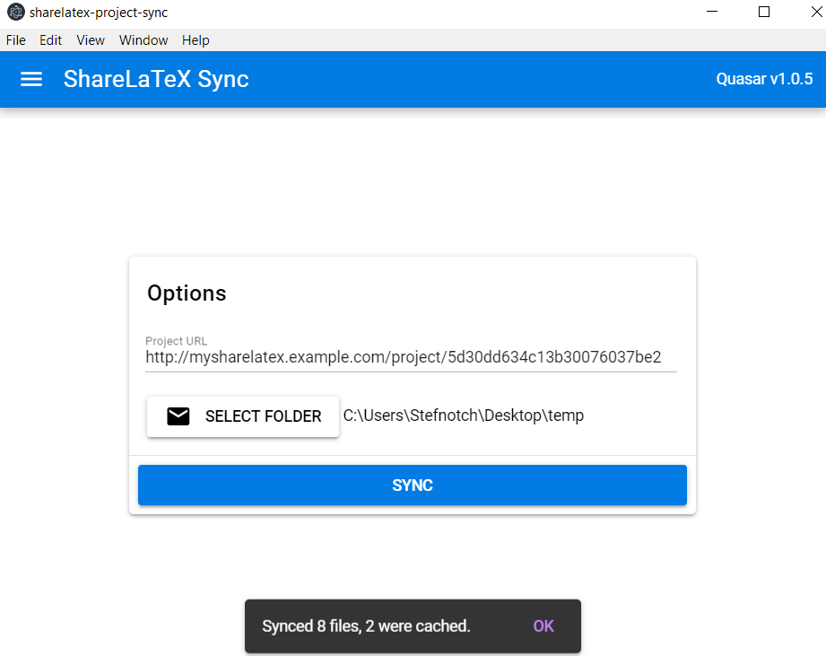

# ShareLaTeX Project Sync

Syncs ShareLaTeX project with a folder on your hard-drive.





## Features

- ShareLaTeX project downloading
- File caching


## Limitations

- **Doesn't upload files yet**, so it's just a downloader 
- Doesn't work with [Overleaf](https://github.com/stefnotch/sharelatex-project-sync/issues/4)


## Developer Instructions

### Install the dependencies
```bash
npm install
```

### Start the app in development mode 
```bash
npm run dev
```


### Build the app for production
```bash
npm run build
```
